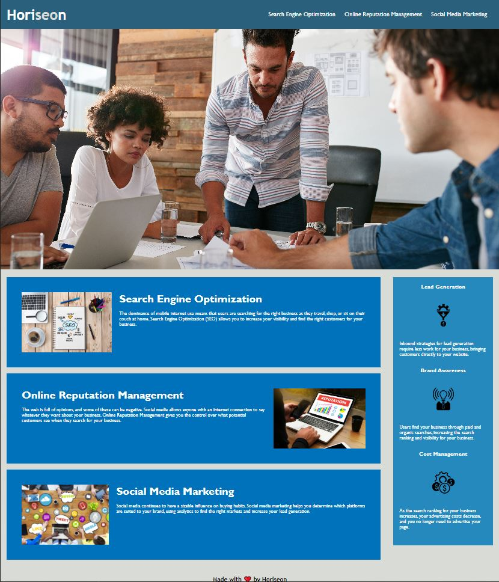

# UW01-refactoring-for-accessibility

## Description

This project was designed as an exercise in refactoring code to meet accessibility standards. I made changes to an existing webpage's html and css files. In addition, certain attributes were added such as alt-text attributes on images to increase accessibility. This was all done without changing the original layout of the page. I learned the importance of accessibilty features, as well as basic html and css best practices.

The site can be viewed here: [https://dingbat-weasel.github.io/UW01-refactoring-for-accessibility/](https://dingbat-weasel.github.io/UW01-refactoring-for-accessibility/)

## Preview

    

## Credits

Original files and methodology provided by the University of Washington Coding Bootcamp in association with edX.

## License

No License